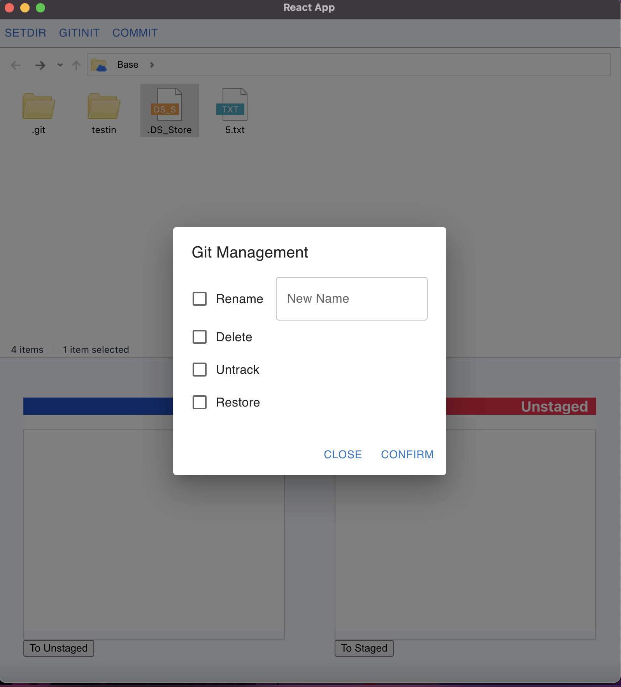
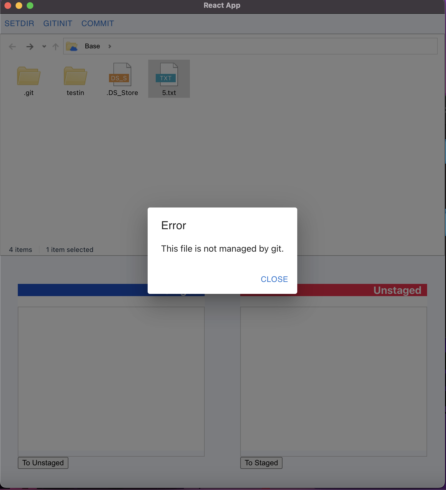

## OSW23CAU21 

## 🧑‍🤝‍🧑 Members

| StudentID| Name  |
|----------| ------|
| 20182213 | 김명진 |
| 20195910 | 김유진 |
| 20172861 | 김재민 |
| 20165545 | 조현우 |

## 🕰️ Project Duration

 * May 8 ~ June 12

## Used Collaboration tool

* Notion : https://little-butternut-09d.notion.site/c4d7e168711945188847b3f08fe8fccd?v=bb19e9db28f5434dad91f54ec12ccc10

* Discord : https://discord.gg/vPn2sy6y

## Prerequiste


```
@mui/material (for dialogs, buttons, and UIs) "^5.13.0"  
@chonky fileexplorer (for file explorers) "^2.3.2"  
@chonky chonky-icon-fontawesome (for icons) "^2.3.2"  
@diff (for getting diff) "^5.1.0"  
@electron-store (for storing data with encryptions) "^8.1.0"  
```


## Initial Project Setting

### You must have both yarn and npm to develop tests!!


### How to use


* git clone 
```
https://github.com/OSW23CAU21/OSW21_GIT_CLIENT.git
```
yarn설치, npm설치, 리액트설치, electron 설치, 버젼, 설정

* if you want to start yarn (1.22.19)
```
$ yarn install
$ yarn start
```

* if you want to start npm(9.5.1)
```
$ npm install
$ npm start 
```

### 🍎 Executable Environment

* MacOS environment 

### 🍎 Member's test environment

김명진
- MacOS Apple M1 Pro Ventura 13.0

김유진
- MacOS Apple M1 Air Ventura 13.1

김재민 
- MacOS Apple M1 Pro Monterey 12.5.1(대여)

조현우
- MacOS Apple M1 Max Ventura 13.1

## Description
### 1. Start page  
&nbsp;&nbsp;&nbsp;   

* When starting the program, all folder isn't specified. (Left)
* Press `SETDIR` at the top and specify Base through OS file manager. (Right)
---
&nbsp;&nbsp;&nbsp;   

* After the Base is designated, the folder informantion is output through the GUI, and it can be freely moved through the file path window at the top by double-clicking. (Left)
* Base must be a folder containing `.git` to support git functions. (Right)
---

### 2. Commit  
 &nbsp;&nbsp;&nbsp;   

* Changes have occurred.(when changing folders or file files through an external program, be sure to press `Command` + `R` to refresh.) (Left)
* If you click the element inside the unstaged window at the bottom and press the button, you can use the staging function as normal adaptation. (Right)
---
 &nbsp;&nbsp;&nbsp;   

* The console window of the changed content.(Left)
* If you want to commit the changes, click `COMMIT` at the top.(Right)
---
 &nbsp;&nbsp;&nbsp;   

* You can commit by entering the CommitMessage, Name, and E-mail. (Left)
* When Commit is in progress, the elements inside Unsatged and Staged are changed according to the committed content.(Right)
---
  

* Console Commit log  
---

### 3. Gitinit  
&nbsp;&nbsp;&nbsp;   

* This directory is in a completely commited state, that is, in an unmodified state. (Left) 
* There is no `.git` file in the subfolder of that directory, but you can see whether it is gitmanagement or not through Head reference.(Right)
---
&nbsp;&nbsp;&nbsp;   

* When executed, a pop-up window appears saying that git init is impossible.(Left)
* `.git` is a directory that exists, but has an untracked foder `testin`.(Right)
---
&nbsp;&nbsp;&nbsp;   

* When you go down to that folder and try git Init, gitInit is not executed by checking the Base folder.(Left)
* However, if the Base folder is set to an untracked subfolder, `.git` can be created through gitInit.(Right)
---

### 4. Fileopen
&nbsp;&nbsp;&nbsp;   

* When double-clicking a file in the GUI, the file manager screen opens. 
* The file manager is open when it is under GIT management(Left), but not open when it is not under GIT management(Right).
* Only one admin option can be set, and it works based on Git commands such as `git rm`, `git restore`.
* However, if you select Rename and do not enter a name to change, the change will not be applied.
---


## Wireframe


## Bugs. 
1. when you set Base directory in Git space, BaseName is not branch name. 
2. when you executes files in workspace sometimes it not opens properly. (getting .id error). 
3. when you opening added file to see git diff, error occurs 
-> solved by changing 'added', 'untracking' files openable status to false 
-> We think alert to when user try to open new files in git space


## for future supports. 
1. Developing WorkSpace File actions (Rename, Delete, CreateFile, CreateFolders)
2. Developing Gitspace File Actions (To Unstaged, To Staged)
3. Adding Git Inits to Switch Fab button following under conditions. 
    - when Base folder is not managed by git, must be plus Iconn (not apple or github)
    - when you clicks + buttons git Initiation will be executed. (same as create .git)
4. Switching three fab buttons by Switch Fab conditions. 
    - If we are in workspace User will access Three buttons (git_clone, branch managing, refresh) ## is MVP
    - If we are in gitspace User will accces Three buttons (commit, gitPush, gitPull) ## not MVP
5. saving User Infos by Encryption (folderchain, base's rootpath, Author name, Author email, access token to github)
6. loading User Infos by decryption


